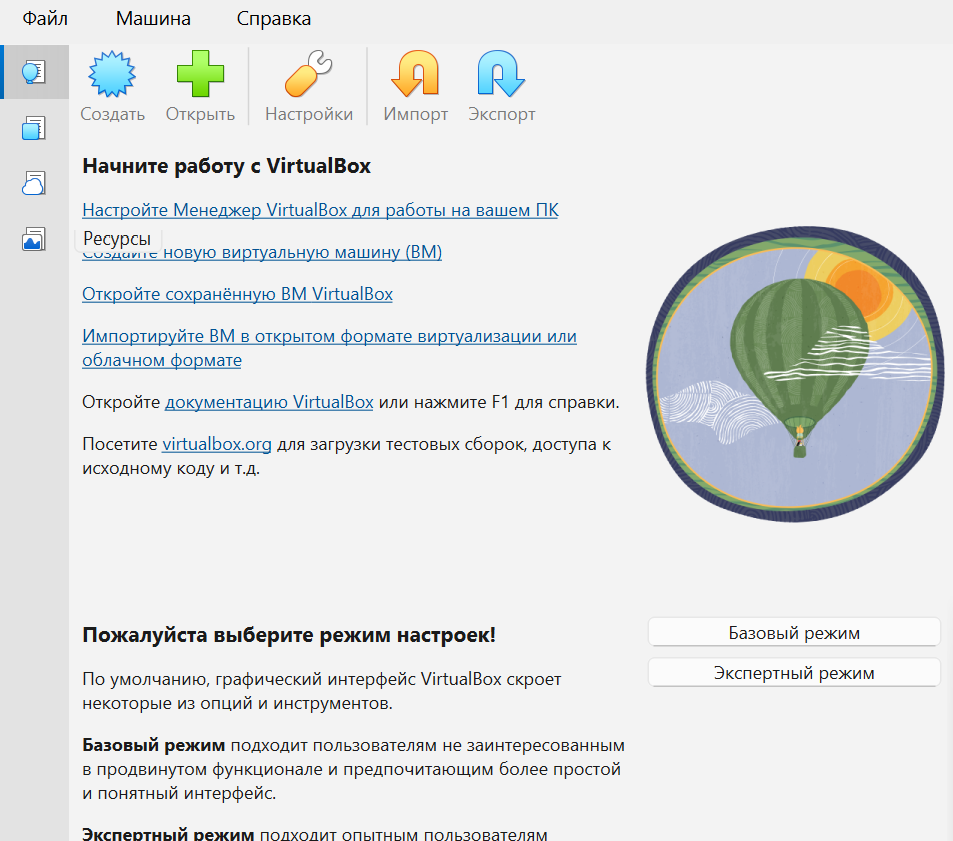
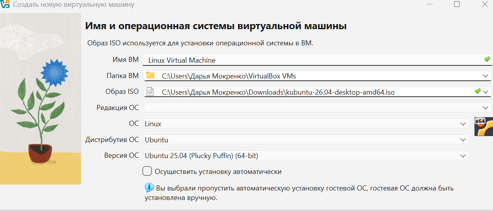
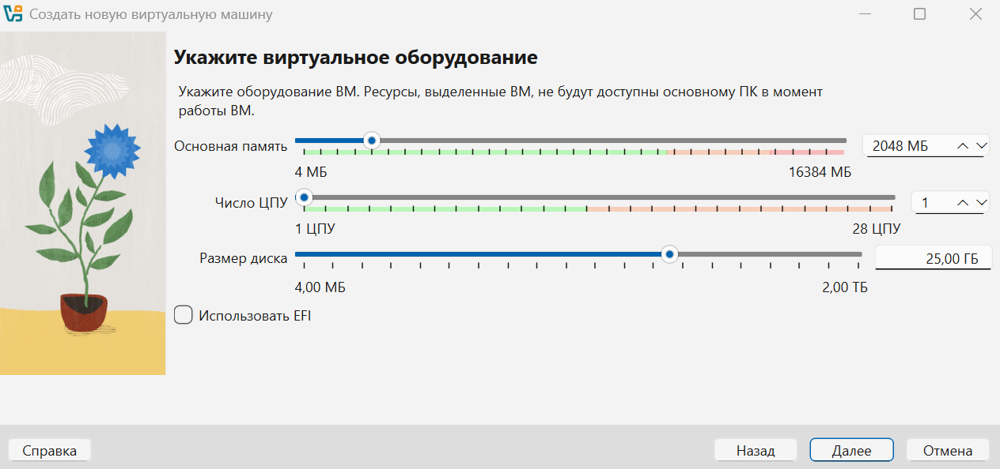
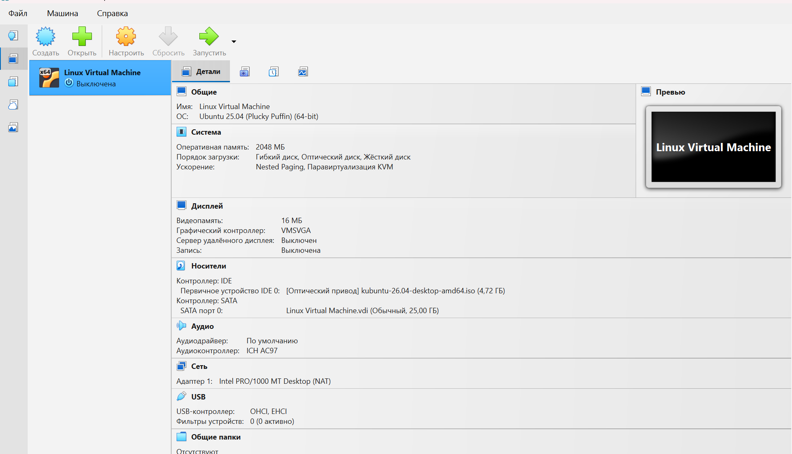
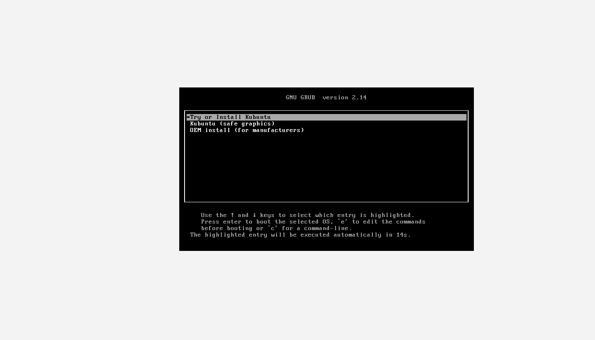
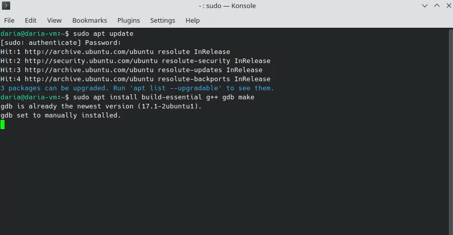
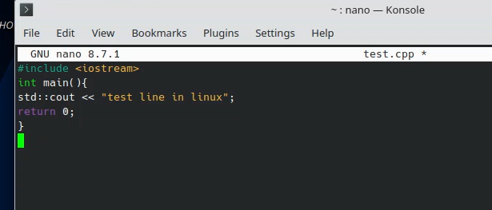

# Лабораторная работа 4. Знакомство с Linux.

## 1. Выбор варианта дистрибутива.
Вариант дистрибутива был выбран из таблицы с помощью команды  
`echo "Мокренко Дарья Владимировна" | md5sum`.  
В результате получилось `4792470c625c0bbf1e6077ea3110e5b5`, первый символ - "4", следовательно мой вариант - Ubuntu + KDE (Kubuntu).
## 2. Изучение особенностей дистрибутива.
### Детали.
- __Разработка__ - Canonical Ltd.  
- __Поддержка__ - Kubuntu Council  
- __Базовый дистрибутив__ - Ubuntu  
- __Последний релиз__ - Kubuntu 25.10/Kubuntu 24.04 LTS  
- __Частота выпуска релизов__ - каждые 6 месяцев; LTS-версии (Long Term Support) - каждые 2 года в апреле
- __Полезные ресурсы:__ 
    - Kubuntu.org (официальный сайт)
    - Ubuntu.com (официальный сайт)
    - Ubuntu Documentation (документация)
    - KDE Documentation (документация)
    - Ask Ubuntu (форум)
### Пакетный менеджер.
Kubuntu использует формат пакетов `.deb`.
- Поиск пакета: `apt search`
- Установка пакета: `sudo apt install`
- Обновление пакетов: `sudo apt update`
- Удаление пакета: `sudo apt remove`
### Процесс установки.
1. Загрузка ISO-образа с [сайта Kubuntu](kubuntu.org).
2. Создание виртуальной машины в VirtualBox.
3. Запуск ВМ и следование шагам мастера установки.
4. Настроить язык, раскладку клавиатуры, подключение к сети.
5. Создать пользователя.
6. Перезагрузить ПК.
[Установка Kubuntu](https://userbase.kde.org/Kubuntu/Installation)
### Минимальные требования.
__Для Kubuntu__: 
- CPU: 64-битный двухъядерный процессор 2 GHz
- RAM: 2 ГБ
- Диск: 25 ГБ  

__Для KDE Plasma__: 2 ГБ RAM
## 3. Установка ОС.
Сначала необходимо создать виртуальную машину VirtualBox, подсоединив к ней ISO-файл Kubuntu.
После установки:

Нажимаем *Создать* виртуальную машину:

Настраиваем:

После настройки в главном меню появляется виртуальная машина, нажимаем *Запустить*:

Далее при запуске нажимаем *Try or install Kubuntu* и ждем загрузку рабочего стола KDE, далее нажимаем *Install Ubuntu*.

В установщике __Calamares__ настраиваем систему и перезагружаем ВМ. После перезагрузки вводим пароль и попадаем на рабочий стол.
## 4. Настройка и установка пакетов.
### Возможность открывать несколько программ (окон), переключаться между ними.
Переключение на _Alt+Tab_

### Отслеживание системных ресурсов (оперативной памяти, загрузки ЦПУ, количество места на диске), управление процессами.

### Настройка логина/пароля пользователя; блокировка экрана.

### Работа с файловой системой (файловый менеджер или проводник).

### Выход в интернет (браузер).

### Настройка сетевых подключений.
Настройка сети осуществляется через _Network Manager_.

### Инструменты для разработки (компилятор, отладчик, среда разработки).
Для этого требуется установка дополнительных пакетов.
Сначала обновим пакеты `sudo apt update`.
Установим компилятор и отладчик `sudo apt install build-essential g++ gdb make`.

Далее создадим файл в редакторе nano с помощью команды `nano test.cpp`.
Запишем тестовый код:

Скомпилируем: `g++ test.cpp -o test_cpp`.
Запустим: `./test_cpp`.
