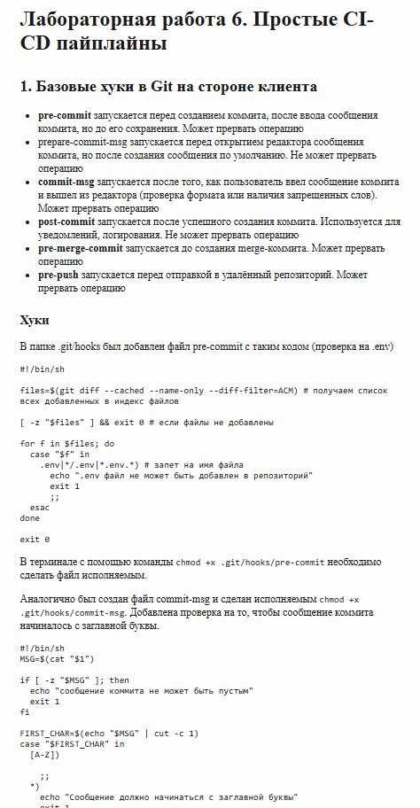

# Лабораторная работа 6. Простые CI-CD пайплайны

## 1. Базовые хуки в Git на стороне клиента
- __pre-commit__ запускается перед созданием коммита, после ввода сообщения коммита, но до его сохранения. Может прервать операцию
- prepare-commit-msg запускается перед открытием редактора сообщения коммита, но после создания сообщения по умолчанию. Не может прервать операцию
- __commit-msg__ запускается после того, как пользователь ввел сообщение коммита и вышел из редактора (проверка формата или наличия запрещенных слов). Может прервать операцию
- __post-commit__ запускается после успешного создания коммита. Используется для уведомлений, логирования. Не может прервать операцию
- __pre-merge-commit__	запускается до создания merge-коммита. Может прервать операцию
- __pre-push__ запускается перед отправкой в удалённый репозиторий. Может прервать операцию

### Хуки
В папке .git/hooks был добавлен файл pre-commit с таким кодом (проверка на .env)
```
#!/bin/sh

files=$(git diff --cached --name-only --diff-filter=ACM) # получаем список всех добавленных в индекс файлов

[ -z "$files" ] && exit 0 # если файлы не добавлены

for f in $files; do
  case "$f" in
    .env|*/.env|*.env.*) # запет на имя файла
      echo ".env файл не может быть добавлен в репозиторий"
      exit 1
      ;;
  esac
done

exit 0
```
В терминале с помощью команды `chmod +x .git/hooks/pre-commit` необходимо сделать файл исполняемым.

Аналогично был создан файл commit-msg и сделан исполняемым `chmod +x .git/hooks/commit-msg`.
Добавлена проверка на то, чтобы сообщение коммита начиналось с заглавной буквы.
```
#!/bin/sh
MSG=$(cat "$1")

if [ -z "$MSG" ]; then
  echo "сообщение коммита не может быть пустым"
  exit 1
fi

FIRST_CHAR=$(echo "$MSG" | cut -c 1)
case "$FIRST_CHAR" in
  [A-Z])

    ;;
  *)
    echo "Сообщение должно начинаться с заглавной буквы"
    exit 1
    ;;
esac

exit 0
```
### Тестирование
В корневую папку проекта был добавлен файл .env.
Пробный коммит:
```
Дарья Мокренко@DESKTOP-V1FLN27 MINGW64 ~/git_labs (report)
$ git add .env

Дарья Мокренко@DESKTOP-V1FLN27 MINGW64 ~/git_labs (report)
$ git commit -m "env"
.env файл не может быть добавлен в репозиторий
```
```
Дарья Мокренко@DESKTOP-V1FLN27 MINGW64 ~/git_labs (report)
$ git add .

Дарья Мокренко@DESKTOP-V1FLN27 MINGW64 ~/git_labs (report)
$ git commit -m "lab6"
Сообщение должно начинаться с заглавной буквы
```
## 2. Хуки Git на стороне сервера
Конвертировать Markdown-файл в html-файл можно с помощью Pandoc `sudo apt install pandoc`.
Был добавлен remote репозиторий.
Для создания html файла в клон-репозиторий необходимо добавить хук post-receive:
```
#!/bin/sh

while read oldrev newrev refname; do
    if [ "$refname" = "refs/heads/report6" ]; then
        cd "/c/Users/Дарья Мокренко/Desktop/hook_test"
        git checkout -f report6
        pandoc -s reports/lab6.md -o reports/lab6.html --metadata title="Lab 6"
        echo ">>> HTML updated: reports/lab6.html"
    fi
done

exit 0
```
`chmod +x .git/hooks/post-receive` - теперь хук исполняемый.
`git config receive.denyCurrentBranch updateInstead` - для того, чтобы файл обновлялся при загруженных изменениях.
`git push server report6` - пушим.  


## 3. Сборка с помощью CMake
### Основные понятия
__CMake__ — это система генерации файлов сборки.
|Команда|Функция|
|:------|:------|
|project()|Проект|
|add_executable()|Исполняемый файл|
|add_library()|Библиотека|
|target_link_libraries()|Линковка|
|target_include_directories()|Добавить пути|
|target_sources()|Исходники	|
|target_compile_options()|Опции компиляции|
|target_compile_definitions()|Макросы|
|add_subdirectory()|Подпроекты|
|find_package()|Внешние пакеты|
`sudo apt install cmake` - установка
```
 $ cmake --version
cmake version 3.28.3
```
### Сборка и запуск
__CMakeLists.txt:__
```
cmake_minimum_required(VERSION 3.15)
project(Lab2 VERSION 1.0 LANGUAGES CXX)

set(CMAKE_CXX_STANDARD 17)
set(CMAKE_CXX_STANDARD_REQUIRED ON)

# Библиотека из всех реализаций
add_subdirectory(src)

# Исполняемый файл
add_executable(lab2 src/lab2.cpp)
target_link_libraries(lab2 PRIVATE mylib)

# Тесты
enable_testing()
add_subdirectory(tests)
```
__tests/CMakeLists.txt:__
```
function(add_test_target name source)
    add_executable(${name} ${source})
    target_link_libraries(${name} PRIVATE mylib)
    add_test(NAME ${name} COMMAND ${name}
             WORKING_DIRECTORY ${CMAKE_SOURCE_DIR})
endfunction()

add_test_target(test_basefile test_basefile.cpp)
add_test_target(test_base32file test_base32file.cpp)
add_test_target(test_rlefile test_rlefile.cpp)
add_test_target(test_composition test_composition.cpp)
add_test_target(test_base32file2 test_base32file2.cpp)
add_test_target(test_rlefile2 test_rlefile2.cpp)
```
__src/CMakeLists.txt:__
```
add_library(mylib STATIC
    BaseFile.cpp
    mystring.cpp
)

target_include_directories(mylib PUBLIC ${CMAKE_CURRENT_SOURCE_DIR})
```
```
darya@DESKTOP-V1FLN27 build $ cmake -S . -B build
CMake Error: The source directory "/mnt/c/cmake/lab2/build" does not appear to contain CMakeLists.txt.
Specify --help for usage, or press the help button on the CMake GUI.
darya@DESKTOP-V1FLN27 build $ cd ..
darya@DESKTOP-V1FLN27 lab2 $ cmake -S . -B build
-- Configuring done (0.1s)
-- Generating done (0.7s)
-- Build files have been written to: /mnt/c/cmake/lab2/build
darya@DESKTOP-V1FLN27 lab2 $ cmake --build build
[ 17%] Built target mylib
gmake[2]: Warning: File 'CMakeFiles/lab2.dir/compiler_depend.make' has modification time 0.0074 s in the future
gmake[2]: warning:  Clock skew detected.  Your build may be incomplete.
[ 29%] Built target lab2
gmake[2]: Warning: File 'tests/CMakeFiles/test_basefile.dir/compiler_depend.make' has modification time 0.012 s in the future
gmake[2]: warning:  Clock skew detected.  Your build may be incomplete.
[ 41%] Built target test_basefile
gmake[2]: Warning: File 'tests/CMakeFiles/test_base32file.dir/compiler_depend.make' has modification time 0.014 s in the future
gmake[2]: warning:  Clock skew detected.  Your build may be incomplete.
[ 52%] Built target test_base32file
gmake[2]: Warning: File 'tests/CMakeFiles/test_rlefile.dir/compiler_depend.make' has modification time 0.022 s in the future
gmake[2]: warning:  Clock skew detected.  Your build may be incomplete.
[ 64%] Built target test_rlefile
gmake[2]: Warning: File 'tests/CMakeFiles/test_composition.dir/compiler_depend.make' has modification time 0.02 s in the future
gmake[2]: warning:  Clock skew detected.  Your build may be incomplete.
[ 76%] Built target test_composition
gmake[2]: Warning: File 'tests/CMakeFiles/test_base32file2.dir/compiler_depend.make' has modification time 0.042 s in the future
gmake[2]: warning:  Clock skew detected.  Your build may be incomplete.
[ 88%] Built target test_base32file2
gmake[2]: Warning: File 'tests/CMakeFiles/test_rlefile2.dir/compiler_depend.make' has modification time 0.051 s in the future
gmake[2]: warning:  Clock skew detected.  Your build may be incomplete.
[100%] Built target test_rlefile2
darya@DESKTOP-V1FLN27 lab2 $ cd build
darya@DESKTOP-V1FLN27 build $ ctest --output-on-failure
Test project /mnt/c/cmake/lab2/build
    Start 1: test_basefile
1/6 Test #1: test_basefile ....................   Passed    0.04 sec
    Start 2: test_base32file
2/6 Test #2: test_base32file ..................   Passed    0.08 sec
    Start 3: test_rlefile
3/6 Test #3: test_rlefile .....................   Passed    0.04 sec
    Start 4: test_composition
4/6 Test #4: test_composition .................   Passed    0.07 sec
    Start 5: test_base32file2
5/6 Test #5: test_base32file2 .................   Passed    0.08 sec
    Start 6: test_rlefile2
6/6 Test #6: test_rlefile2 ....................   Passed    0.04 sec

100% tests passed, 0 tests failed out of 6

Total Test time (real) =   0.42 sec
```
- cmake -S . -B build читает CMakeLists.txt, создаёт папку build
- cmake --build build компилирует библиотеку, lab2 и тесты
- ctest --output-on-failure запускает тесты.