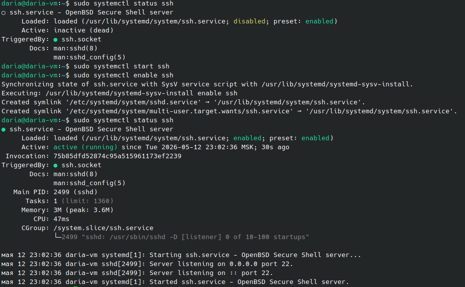
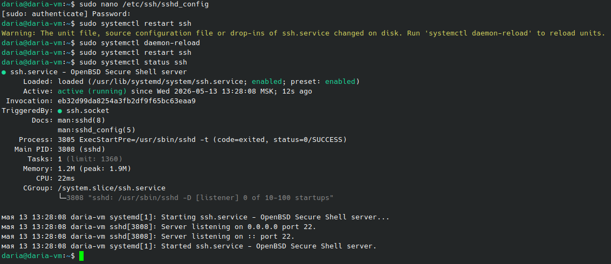
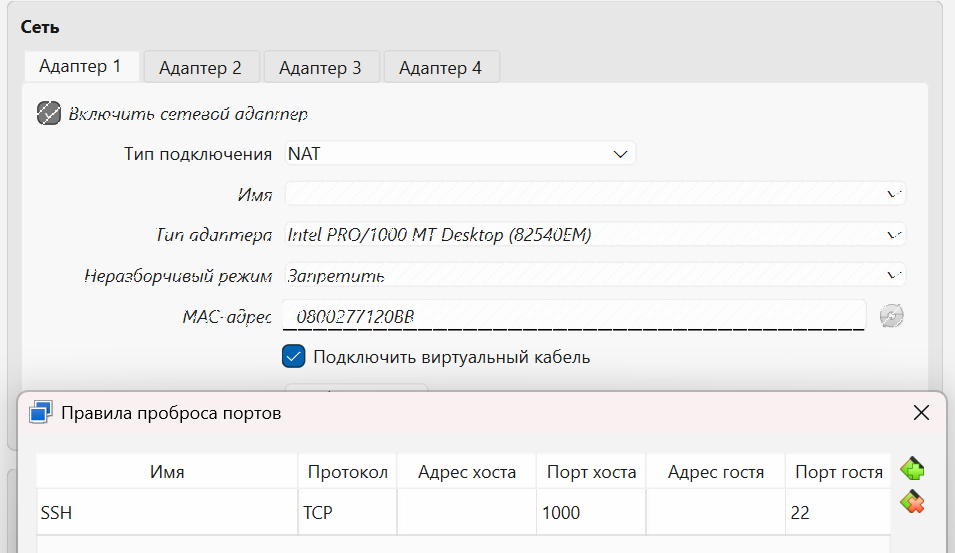

# Лабораторная работа №7. Развертывание на целевой машине.
## Создание виртуальной машины
В лабораторной работе №4 был использован дистрибутив Kubuntu, для виртуализации используется VirtualBox.
### Опасности 
- доступ к файловой системе пользователя (домашняя директория, SSH-ключи)
- возможность чтения или записи в системные папки
- доступ к системным логам
- возможность запуска процессов от имени пользователя
## Настройка удалённого доступа
`sudo apt install openssh-server` - установка SSH на виртуальную машину  
`sudo systemctl start ssh` - запуск службы  
`sudo systemctl enable ssh` - включение автозапуска при загрузке системы  
`sudo systemctl status ssh` - проверка статуса  

  

__TCP-порт__ — числовой идентификатор (1–65535), который позволяет ОС различать сетевые соединения, SSH по умолчанию использует порт 22.   
__Проброс портов__ — механизм VirtualBox, перенаправляющий трафик с порта хостовой ОС на порт гостевой ВМ.  
Настроить проброс портов можно через VirtualBox: _Машина -> Настройки -> Сеть и Проброс портов_
- Порт хоста: 1000  
- Порт гостя: 22  (стандартный)  

## Подключение через основную ОС по паролю  
```powershell
ssh -p 1000 daria@localhost
The authenticity of host '[localhost]:1000 ([127.0.0.1]:1000)' can't be established.
ED25519 key fingerprint is SHA256:FylF7CgO1GTkYwhYmFFNmUObhoR/5sR5bSt2lZQGnQ4.
This key is not known by any other names.
Are you sure you want to continue connecting (yes/no/[fingerprint])? yes
Warning: Permanently added '[localhost]:1000' (ED25519) to the list of known hosts.
daria@localhost's password:
Welcome to Ubuntu 26.04 LTS (GNU/Linux 7.0.0-14-generic x86_64)

 * Documentation:  https://docs.ubuntu.com
 * Management:     https://landscape.canonical.com
 * Support:        https://ubuntu.com/pro

Expanded Security Maintenance for Applications is not enabled.

49 updates can be applied immediately.
31 of these updates are standard security updates.
To see these additional updates run: apt list --upgradable

1 additional security update can be applied with ESM Apps.
Learn more about enabling ESM Apps service at https://ubuntu.com/esm


The programs included with the Ubuntu system are free software;
the exact distribution terms for each program are described in the
individual files in /usr/share/doc/*/copyright.

Ubuntu comes with ABSOLUTELY NO WARRANTY, to the extent permitted by
applicable law.
```

## Подключение через публичный ключ 

`ssh-keygen -t ed25519` - генерация ssh-ключа на основной ОС.
```powershell
ssh-keygen -t ed25519
Generating public/private ed25519 key pair.
Enter file in which to save the key (C:\Users\Дарья Мокренко/.ssh/id_ed25519):
Enter passphrase (empty for no passphrase):
Enter same passphrase again:
Your identification has been saved in C:\Users\Дарья Мокренко/.ssh/id_ed25519
Your public key has been saved in C:\Users\Дарья Мокренко/.ssh/id_ed25519.pub
The key fingerprint is:
SHA256:M3iHNgT1fxSz1+guQ4LUq24vrPt755pfgoKJyt57F60 
The key's randomart image is:
+--[ED25519 256]--+
|      ...     o  |
|       . o     =.|
|        o o   + o|
|       + o o o . |
|      . S.+ o o  |
|     . =.*.+ o   |
|    . o.oo. + o  |
| . o  ..E....=   |
| .+ ooo*+=+=o    |
+----[SHA256]-----+
```

`ssh-copy-id -p 1000 daria@localhost` - копирование ключа на ВМ
```
$ ssh-copy-id -p 1000 daria@localhost
/usr/bin/ssh-copy-id: INFO: Source of key(s) to be installed: "/c/Users/Дарья Мокренко/.ssh/id_ed25519.pub"
The authenticity of host '[localhost]:1000 ([127.0.0.1]:1000)' can't be established.
ED25519 key fingerprint is: SHA256:FylF7CgO1GTkYwhYmFFNmUObhoR/5sR5bSt2lZQGnQ4
This key is not known by any other names.
Are you sure you want to continue connecting (yes/no/[fingerprint])? yes
/usr/bin/ssh-copy-id: INFO: attempting to log in with the new key(s), to filter out any that are already installed
The authenticity of host '[localhost]:1000 ([127.0.0.1]:1000)' can't be established.
ED25519 key fingerprint is: SHA256:FylF7CgO1GTkYwhYmFFNmUObhoR/5sR5bSt2lZQGnQ4
This key is not known by any other names.
Are you sure you want to continue connecting (yes/no/[fingerprint])? yes
/usr/bin/ssh-copy-id: INFO: 1 key(s) remain to be installed -- if you are prompted now it is to install the new keys
The authenticity of host '[localhost]:1000 ([127.0.0.1]:1000)' can't be established.
ED25519 key fingerprint is: SHA256:FylF7CgO1GTkYwhYmFFNmUObhoR/5sR5bSt2lZQGnQ4
This key is not known by any other names.
Are you sure you want to continue connecting (yes/no/[fingerprint])? yes
Could not create directory '/c/Users/\304\340\360\374\377 \314\356\352\360\345\355\352\356/.ssh' (No such file or directory).
Failed to add the host to the list of known hosts (/c/Users/\304\340\360\374\377 \314\356\352\360\345\355\352\356/.ssh/known_hosts).
daria@localhost's password:

Number of key(s) added: 1

Now try logging into the machine, with: "ssh -p 1000 'daria@localhost'"
and check to make sure that only the key(s) you wanted were added.

```

### Проверка на основной ос:
```powershell
ssh -p 1000 daria@localhost
Welcome to Ubuntu 26.04 LTS (GNU/Linux 7.0.0-14-generic x86_64)

 * Documentation:  https://docs.ubuntu.com
 * Management:     https://landscape.canonical.com
 * Support:        https://ubuntu.com/pro

Expanded Security Maintenance for Applications is not enabled.

49 updates can be applied immediately.
31 of these updates are standard security updates.
To see these additional updates run: apt list --upgradable

1 additional security update can be applied with ESM Apps.
Learn more about enabling ESM Apps service at https://ubuntu.com/esm

Last login: Wed May 13 12:15:03 2026 from 10.0.2.2
```
## Отключение входа по паролю
Для того, чтобы отключить эту опцию, необходимо отредактировать конфигурационный файл SSH: `sudo nano /etc/ssh/sshd_config`
надо заменить строку `#PasswordAuthentication yes` на `PasswordAuthentication no`;  

 
Теперь, если проверить вход по паролю, доступ будет отклонен:
`ssh -p 1000 -o PreferredAuthentications=password daria@localhost` -> `daria@localhost: Permission denied (publickey).`, но обычное подключение `ssh -p 1000 daria@localhost` работает

## Настройка сессии для другого пользователя
Мы обменялись с напарницей SSH-ключами для подключения.  
```bash
sudo adduser user
sudo mkdir -p /home/user/.ssh #создание директории для SSH-ключей
sudo chmod 700 /home/user/.ssh
sudo nano /home/user/.ssh/authorized_keys #добавление публичного ключа
sudo chmod 600 /home/user/.ssh/authorized_keys #разрешение доступа
sudo chown -R user:user /home/user/.ssh
```

`ping 10.78.62.236` - ping на IP-адрес напарницы прошел успешно  

Пустые поля - разрешение доступа из локальной сети:

  

`ssh -p 2222 dashka@10.78.62.236` - подключение к виртуальной машине напарницы

## Развертывание программы
Программы были установлены для выполнения лабораторной работы №4.  
### Проверка наличия необходимых программ
```bash
git --version
g++ --version
make --version
```

### Клонирование репозитория
```bash
~$ git clone https://github.com/chifffi/labs_git.git
Клонирование в «labs_git»...
remote: Enumerating objects: 396, done.
remote: Counting objects: 100% (396/396), done.
remote: Compressing objects: 100% (258/258), done.
remote: Total 396 (delta 129), reused 319 (delta 81), pack-reused 0 (from 0)
Получение объектов: 100% (396/396), 5.42 МиБ | 3.31 МиБ/с, готово.
Определение изменений: 100% (129/129), готово.
```

### Запуск тестов
```bash
make test
g++ -g -c -o build/mystring.o src/mystring.cpp
g++ -g -c -o build/basefile.o src/basefile.cpp
g++ -g -c -o build/base32file.o src/base32file.cpp
g++ -g -c -o build/rlefile.o src/rlefile.cpp
g++ -g -c -o build/base32file2.o src/base32file2.cpp
g++ -g -c -o build/rlefile2.o src/rlefile2.cpp
g++ -g -o build/test_basefile.out tests/test_basefile.cpp build/mystring.o build/basefile.o build/base32file.o build/rlefile.o build/base32file2.o build/rlefile2.o
g++ -g -o build/test_base32file.out tests/test_base32file.cpp build/mystring.o build/basefile.o build/base32file.o build/rlefile.o build/base32file2.o build/rlefile2.o
g++ -g -o build/test_rlefile.out tests/test_rlefile.cpp build/mystring.o build/basefile.o build/base32file.o build/rlefile.o build/base32file2.o build/rlefile2.o
g++ -g -o build/test_base32file2.out tests/test_base32file2.cpp build/mystring.o build/basefile.o build/base32file.o build/rlefile.o build/base32file2.o build/rlefile2.o
g++ -g -o build/test_rlefile2.out tests/test_rlefile2.cpp build/mystring.o build/basefile.o build/base32file.o build/rlefile.o build/base32file2.o build/rlefile2.o
g++ -g -o build/test_composition.out tests/test_composition.cpp build/mystring.o build/basefile.o build/base32file.o build/rlefile.o build/base32file2.o build/rlefile2.o
```
### Запуск программы
```bash
make run
./build/lab2.out
```

### Сборка
```bash
make
make: «build/lab2.out» не требует обновления.
```